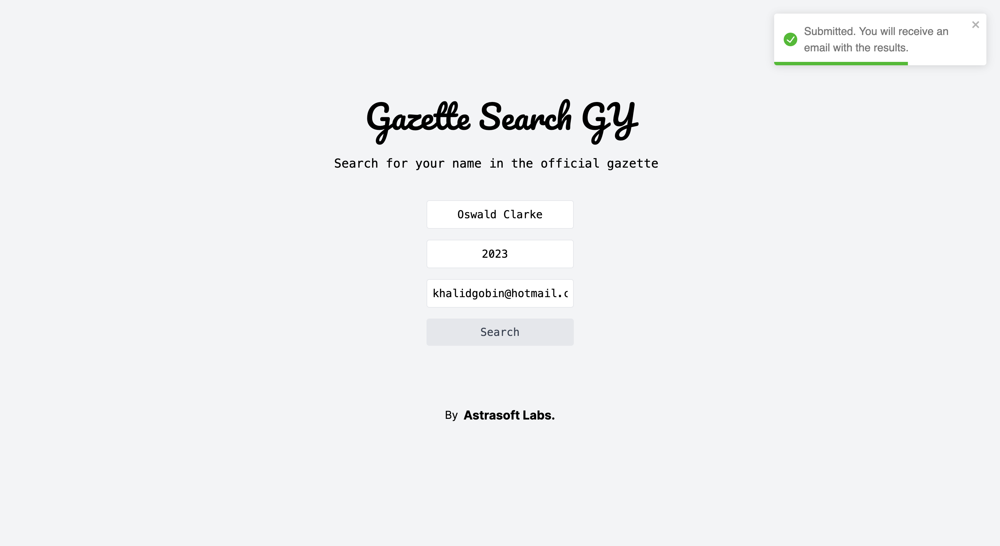

# Gazette Search GY

  <a href="https://www.kgobin.com/">
    <h3 align="center">Gazette Search GY</h3>
  </a>

A Next.js application integrated with Django and BeautifulSoup to scrape and search the official gazette of Guyana.

---

## Table of Contents

- [Introduction](#introduction)
- [Frameworks](#frameworks-used)
- [How It Works](#how-it-works)
  - [URL Rewriting](#url-rewriting)
  - [Local Development](#local-development)
  - [Production](#production)
- [Demo](#demo)
- [Deploy Your Own](#deploy-your-own)
- [Developing Locally](#developing-locally)
- [Learn More](#learn-more)

---

## Introduction

This is a hybrid application that uses Next.js for the frontend and Django with BeautifulSoup for the backend. The application scrapes the official gazette of Guyana from [Official Gazette](https://officialgazette.gov.gy/) to help users search for their names, detect fraud, and monitor contracts. All scraped gazettes are stored in an S3 bucket, and search results are sent to users via Resend.

## Frameworks Used

- **Frontend**: [Next.js](https://nextjs.org/)
- **Backend**: [Django](https://www.djangoproject.com/)
- **Web Scraping**: [BeautifulSoup](https://www.crummy.com/software/BeautifulSoup/)
- **Cloud Storage**: [AWS S3](https://aws.amazon.com/s3/)
- **Notification Service**: [Resend](https://your-resend-link.com/)

## Requirements

### Create an S3 Bucket

1. Sign in to your AWS Management Console.
2. Navigate to the S3 service and click on "Create Bucket".
3. Name your bucket and configure its settings as per your requirements.
4. Make sure to set the bucket permissions appropriately.
5. Click "Create" to finalize the bucket creation.

### Create a Resend Account

1. Visit [Resend's website](https://your-resend-link.com/) and click on "Sign Up".
2. Fill in your details and verify your email address.
3. Once your account is set up, navigate to the dashboard.
4. Create a new project and configure the notification settings.
5. Obtain the API keys or tokens required for integration with your application.

---

### URL Rewriting

The Django/Python server is integrated into the Next.js app under `/api/`. URL rewriting is configured in `next.config.js` to map any request to `/api/:path*` to the Django API.

### Local Development

On localhost, the Django server will be running on a port that you can specify in `next.config.js`.

### Production

In production, the Django server can be hosted on any cloud service that supports Python and Django.

## Deploy Your Own

You can clone this project with the following command:

\`\`\`bash
git clone https://github.com/kgobin2000/gazette-search-gy
\`\`\`

### Configure Environment Variables

In order to configure your environment variables, follow these steps:

1. Locate the `env.sample` file in the `api` folder of this project.
2. Rename `env.sample` to `env.local`.
3. Open the `env.local` file in a text editor.
4. Inside `env.local`, you'll find a list of environment variables. Fill in the necessary values for your project.

## Developing Locally

First, install the dependencies:

\`\`\`bash
npm install

Then, run the development server:

\`\`\`bash
npm run dev

Open [http://localhost:3000](http://localhost:3000) with your browser to see the result. The Django server will be running on a port specified in `next.config.js`.

## Learn More

- [Next.js Documentation](https://nextjs.org/docs) - Learn about Next.js features and API.
- [Django Documentation](https://docs.djangoproject.com/en/3.2/) - Learn about Django features and API.
- [BeautifulSoup Documentation](https://www.crummy.com/software/BeautifulSoup/bs4/doc/) - Learn how to scrape web pages with BeautifulSoup.

---

You can check out [the Gazette Search GY GitHub repository](https://github.com/kgobin2000/gazette-search-gy) - your feedback and contributions are welcome!
